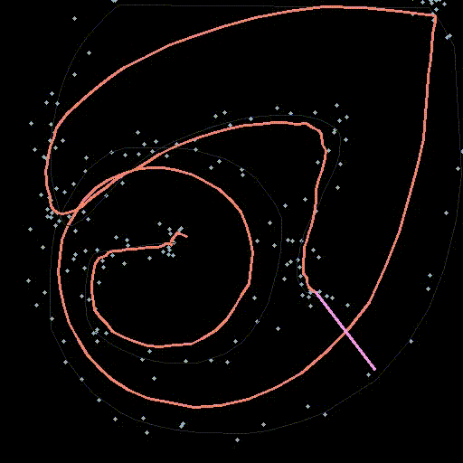

# Kalman Filter

Run `python kalman_filter.py`, interact, check the screen video saved as `mouse-tracking.avi` in `res`.

## Task Description

Develop a python application that uses Kalman filter for smoothing the output of the mouse pointer. Define process model, transition matrix and system noise. Write code as python application with comments.

**Required submission:** code of the system, recorded avi file of the system. Use OpenCV VideoWriter class for storing the video

**Optional:** Use Kalman filter for smoothing the output of the mean shift tracker.
