# Image segmentation

## Implemented tasks

1. Separate text from background [(results)](./res/text)

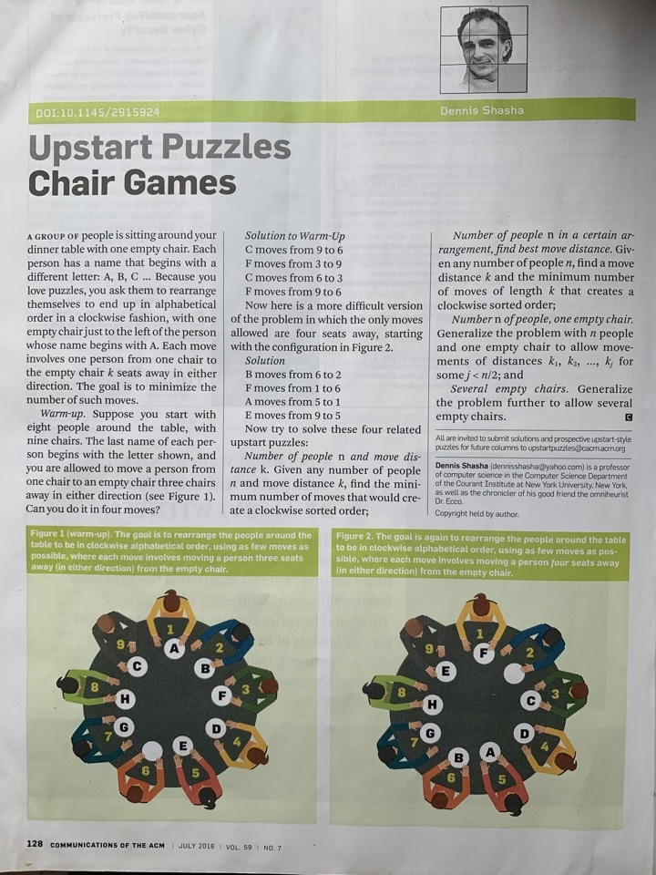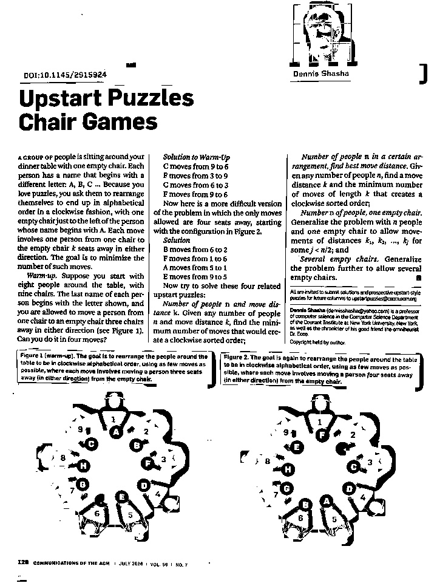

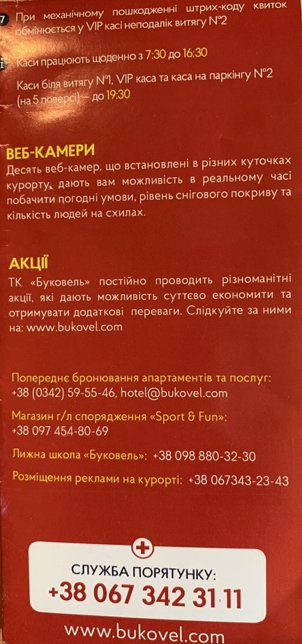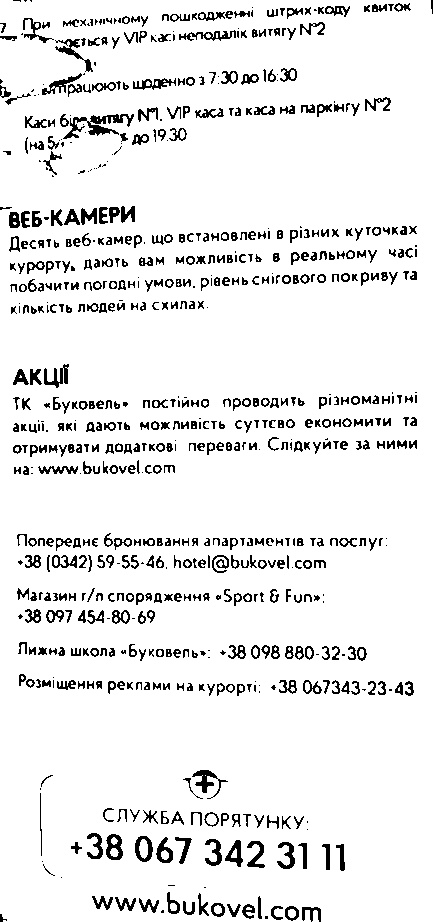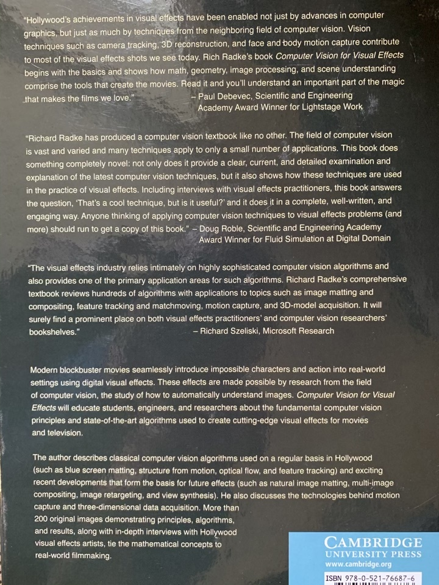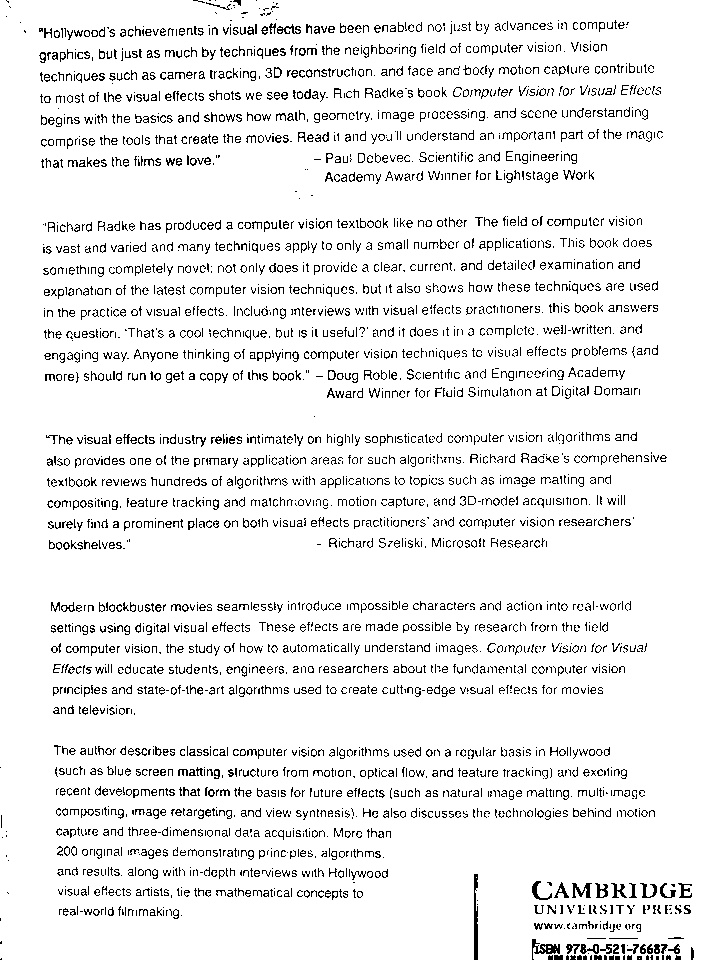

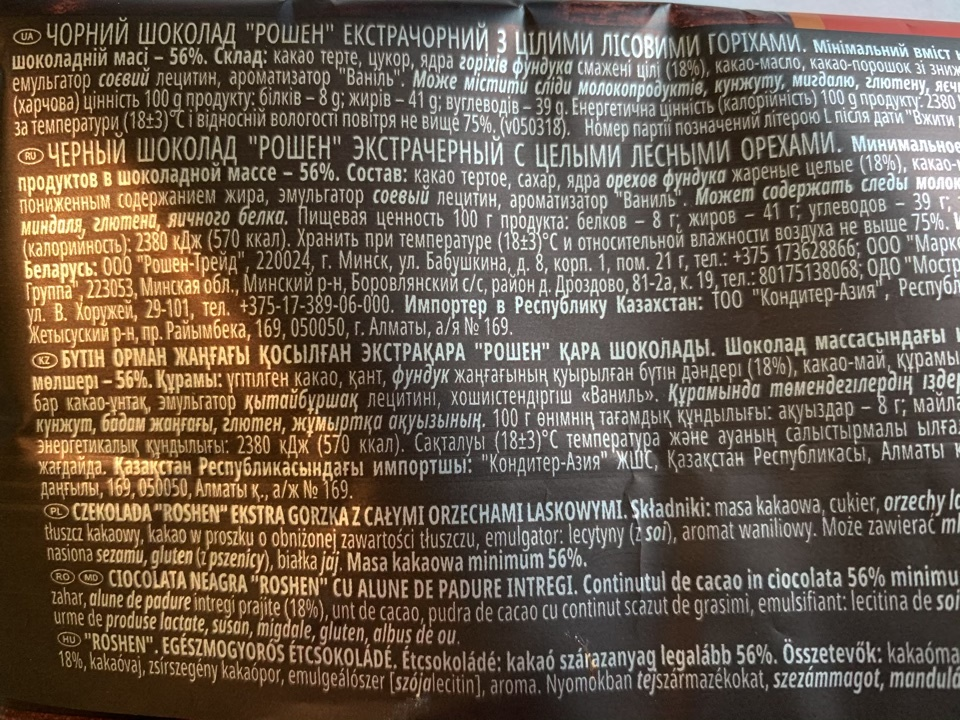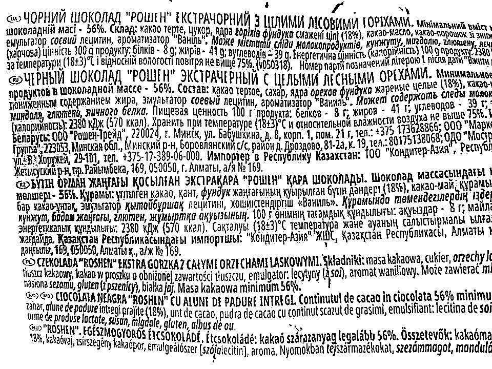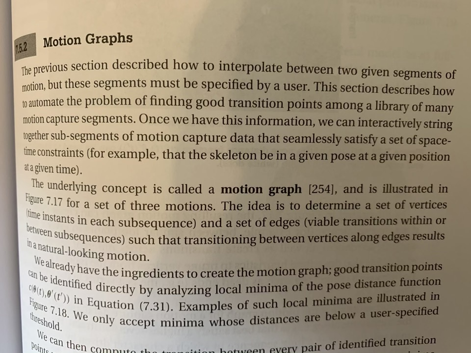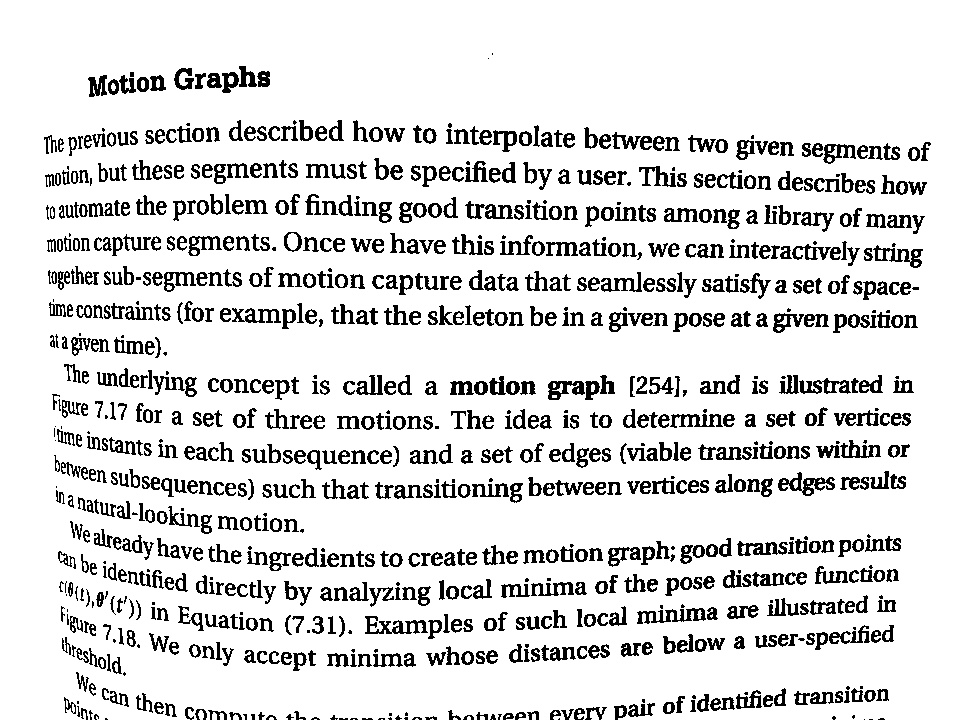

2. Estimate number of objects [(results)](./res/count)

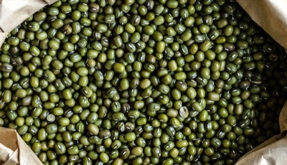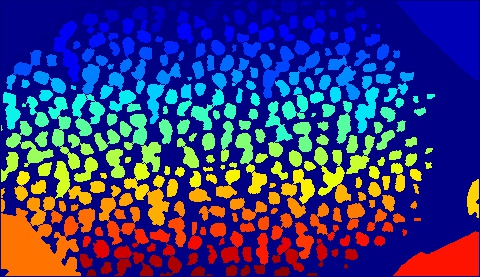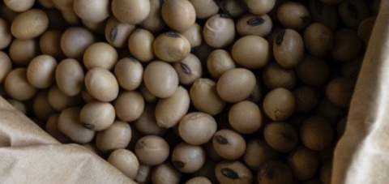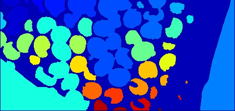

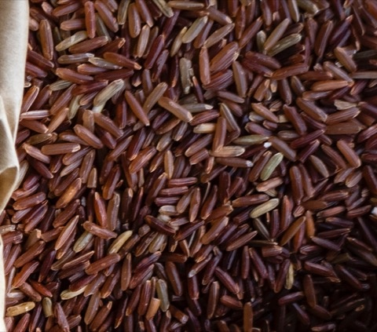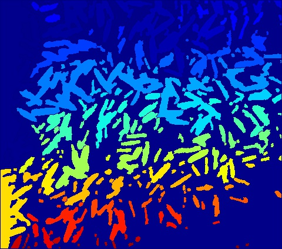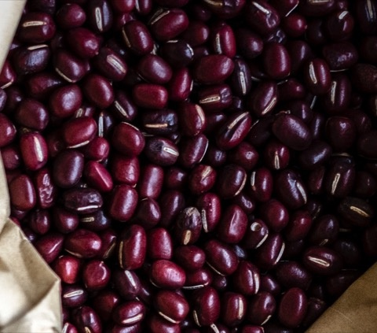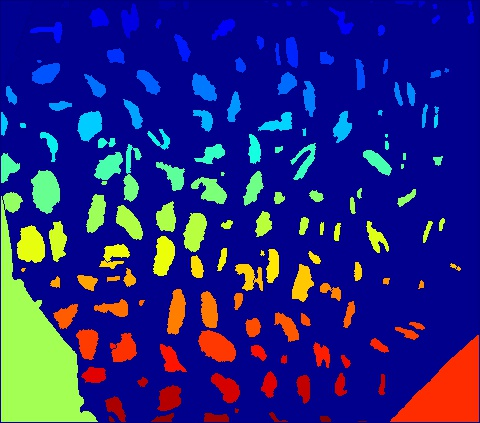

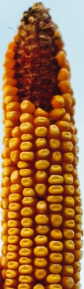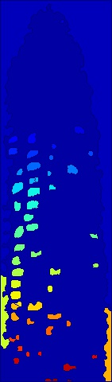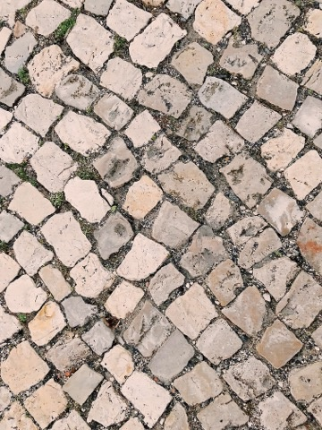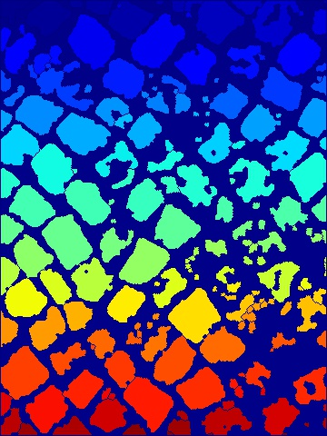

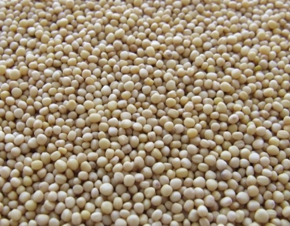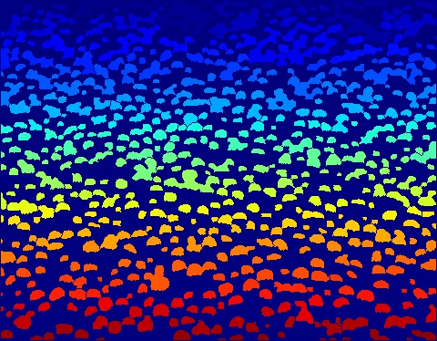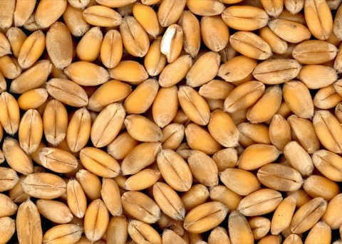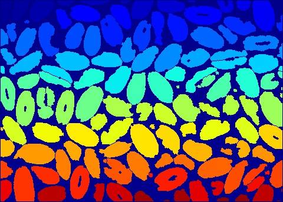

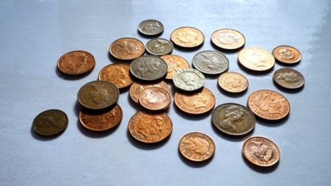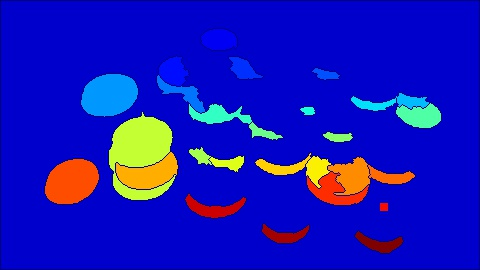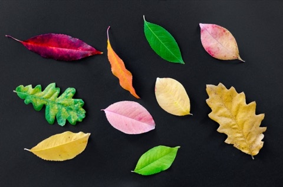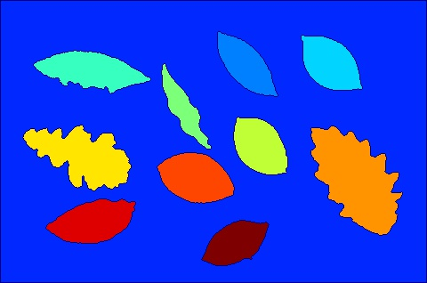

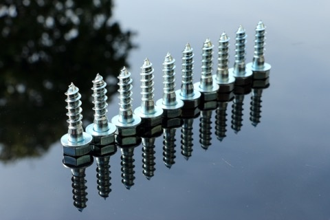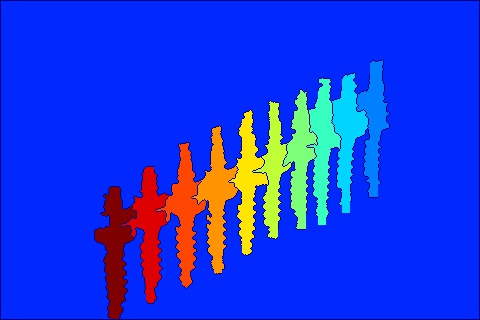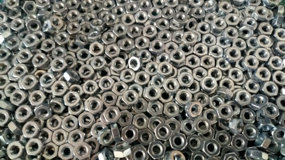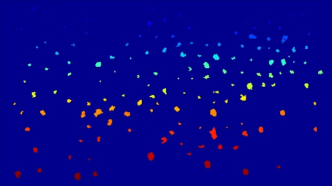

3. Separate object from background [(results)](./res/object)

To check the solutions see `Test-Module2-Day1.ipynb`.